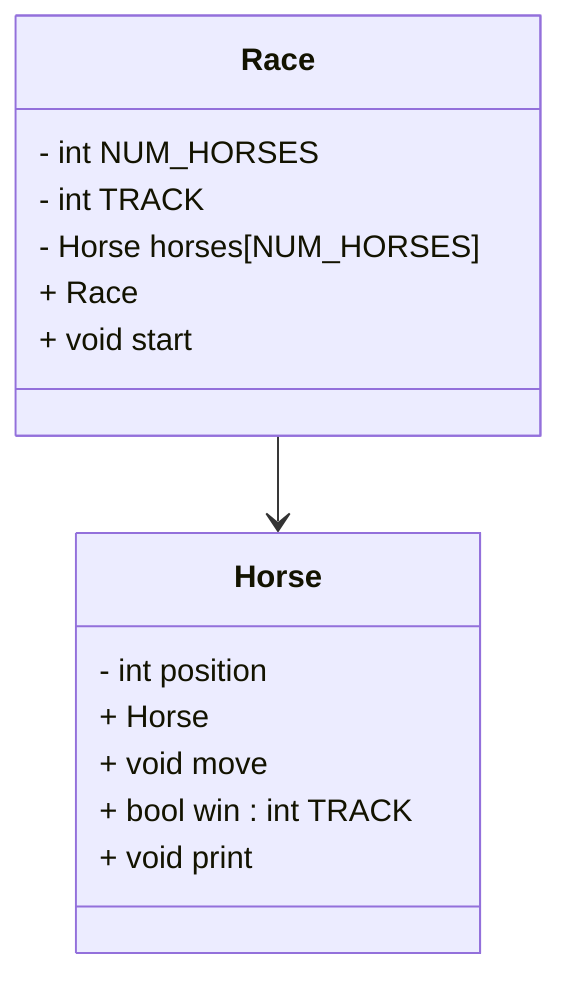

# OPP-Horse
Race UML

```mermaid
classDiagram
class Race {
    - int NUM_HORSES
    - int TRACK
    - Horse horses[NUM_HORSES]
    + Race 
    + void start 
}
class Horse {
    - int position
    + Horse
    + void move 
    + bool win : int TRACK
    + void print
}

Race --> Horse
```

