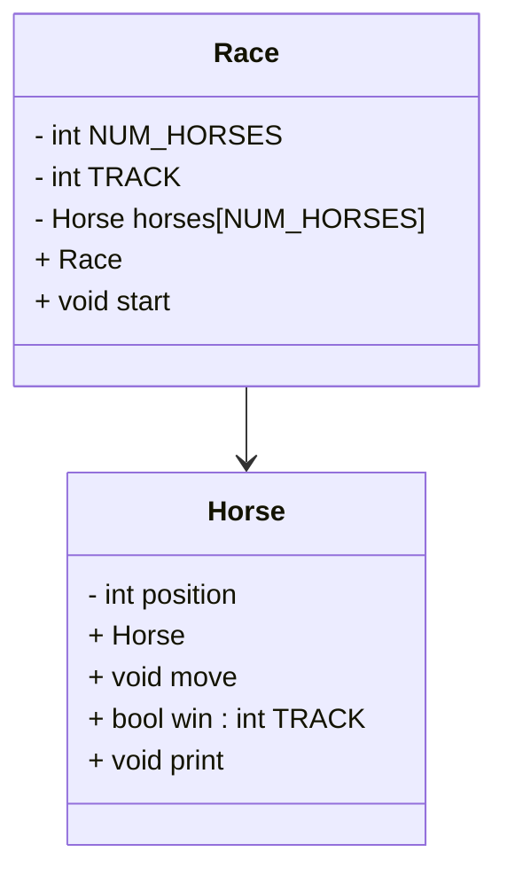

# OPP-Horse
Race UML



## Race()
```
  in header
    int NUM_HORSES to 5
    int TRACK set to 15
  go through each horse
```

## Race.start()
```
  bool keepGoing true
  while keepGoing:
    advance horses
    print horse lane
    if horse wins:
      keepGoing false
```

## Horse::Horse()
```
  set positions to 0
  set index to 0
  set TRACK to 15
```

## Horse::intt (int index, int TRACK)
```
  my index = index
  my TRACK = TRACK
  my position = 0
```

## Horse::advance()
```
  roll random 0-1 int called coin
  add coin to position
```

## Horse::printLane()
```
  for position from 0 to TRACK:
     if position == my position:
       print index
     else
       print "."
     print newline
```

## Bool Horse::IsWinner
```
  bool result = false
  if position >= TRACK
    result = true
    print winning sentence 
  return result
